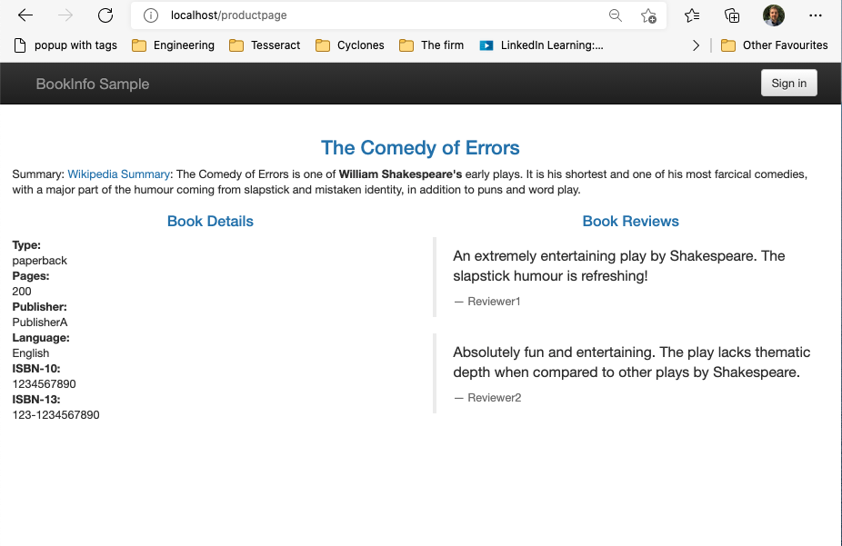

# The Data Plane


> Source: https://istio.io/latest/docs/ops/deployment/architecture/

## Installing Istio

### Prerequisites

**IMPORTANT** You must increase your memory allocation in your local cluster for Istio, or it will not run properly.

	Docker menu > Preferences > Resources
	
	Set CPUs: 4 (6 preferred)
	Set Memory: 5GB (6 preferred)

### Installation

Let's download the Istio bits:

	curl -L https://istio.io/downloadIstio | sh -

This fetches the latest stable version.

Add the Istio CLI to your path:

    export PATH=$PATH:$PWD/istio-1.10.1/bin

> Note: replace `1.10.1` with the version of Istio you downloaded.

Let's install it with the demo profile:

	istioctl install --set profile=demo -y

Check it's up and running:

	kubectl -n istio-system get deploy
	kubectl -n istio-system get IstioOperator installed-state -o yaml

### Enabling sidecar injection

We want Istio to automatically add the necessary sidecars to our Pods. We do this by labelling the namespace that will host the application with `istio-injection=enabled`

    kubectl label namespace default istio-injection=enabled

### Accessing the gateway

Let's find the address of the Istio Ingress Gateway.

```
$ kubectl get svc istio-ingressgateway -n istio-system
NAME                   TYPE           CLUSTER-IP       EXTERNAL-IP   PORT(S)   AGE
istio-ingressgateway   LoadBalancer   172.21.109.129   localhost     ...       17h
```

> Note the `EXTERNAL-IP` and ports, e.g. `localhost` and `80:someport/TCP`.

## The bookinfo application

We will use the 'Book Info' demo application to illustrate Istio.

Let's install it:

```
cd ${ISTIO_HOME}
kubectl apply -f samples/bookinfo/platform/kube/bookinfo.yaml
kubectl apply -f samples/bookinfo/networking/destination-rule-all.yaml
kubectl apply -f samples/bookinfo/networking/bookinfo-gateway.yaml
```

### Let's test it

Open this in your browser: http://localhost/productpage

> Note, replace `localhost` with the external IP and port of the gateway in the previous section.

You should see the following page:



### Exploring Istio

Let's explore the Istio configuration.

    kubectl get pods,virtualservices,destinationrules,gateway

Some points to note:

* The gateway enables network traffic ingress to our services
* Virtual Services abstract our workloads from services
* Destination rules define the versions ('subsets') of our services

### Canary deployment

We're now going to perform a canary deployment of version 2 of our reviews service.

The version of the workload is determined by the labels on the pods.

Let's check the labels for our running reviews pods:

```
$ kubectl get pod -l app=reviews -L version

NAME                    READY   STATUS    RESTARTS   AGE   VERSION
reviews-v1-545db77b95   2/2     Running   0          2m    v1
reviews-v2-7bf8c9648f   2/2     Running   0          2m    v2
reviews-v3-84779c7bbc   2/2     Running   0          2m    v3

```

Now, let's define a VirtualService for reviews:

```yaml
apiVersion: networking.istio.io/v1alpha3
kind: VirtualService
metadata:
  name: reviews
spec:
  hosts:
  - reviews
  http:
  - route:
    - destination:
        host: reviews
        subset: v1
      weight: 75

    - destination:
        host: reviews
        subset: v2
      weight: 25
```

> Versions are referred to as 'subsets'.

Here we are routing 25% of traffic to v2 of the reviews workload.

If we hit the bookinfo application now, roughly 1 in every 4 requests hits the new version of reviews.

### Header matched traffic

Let's say we want to limit access to the new version to those users with a particular header set.

Change our VirtualService to add a 'match' condition instead of the 'weight':

```yaml
apiVersion: networking.istio.io/v1alpha3
kind: VirtualService
metadata:
  name: reviews
spec:
  hosts:
  - reviews
  http:
  - route:
    - destination:
        host: reviews
        subset: v1

  - match:
    - headers:
        user-agent:
          exact: "tester"
    route:
    - destination:
        host: reviews
        subset: v2
```

Here, if the User Agent string matches the value `tester` then Istio routes traffic to version 2 of reviews, otherwise version 1 is used.
