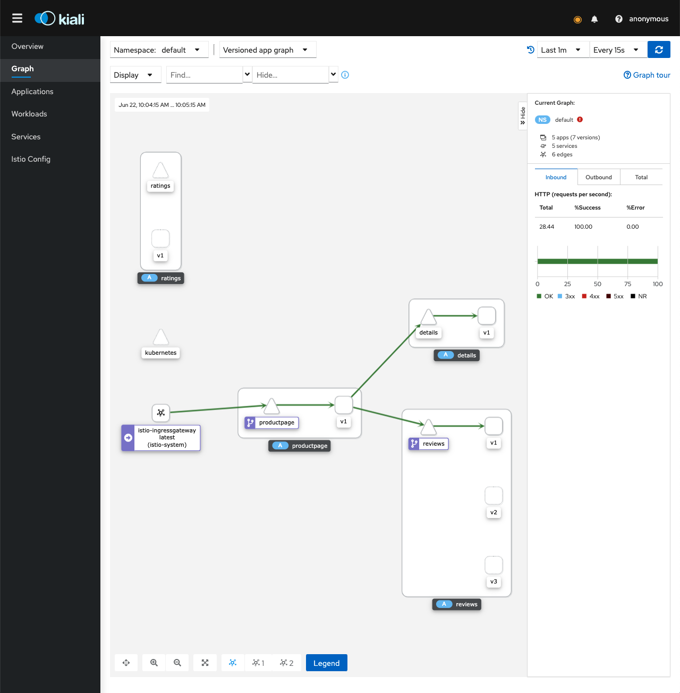

# Operational considerations

- Observability
	- Logging
	- Monitoring
	- Tracing
- Architecture
	- Persistent workloads
	- HA [architecture](./architecture.md)
- Deployment and scaling
	- Advanced deployment strategies
	- Advanced load balancing strategies
	- Scaling and scale-to-zero

## Observability

### Logging

Challenges:

- Ephemeral workloads
- Ephemeral nodes
- Serverless nodes

Strategies:

- Sidecar per pod
- DaemonSet per node
- Embedded within application

### Monitoring

- Prometheus
- APM

#### Service mesh / Istio

Kiali is a tool used to visualise an Istio installation.

If you have installed [Istio](./data-plane.md), you can add support for it as follows:

	cd ${ISTIO_HOME}
	kubectl apply -f samples/addons/prometheus.yaml

> Note: the bundled Kiali file in the Istio distribution doesn't work on Kubernetes >= 1.19.

Install Kiali:

	helm install \
	  --namespace istio-system \
	  --set auth.strategy="anonymous" \
	  --repo https://kiali.org/helm-charts \
	  kiali-server \
	  kiali-server

View Kiali UI:

	${ISTIO_HOME}/bin/istioctl dashboard kiali

> Note: If your applications are not receiving traffic, they will not be visible in the 'Graph' view.
>
> If you want to put your application under load, you can use [hey](https://github.com/rakyll/hey):
> ```
> hey -n 10000 http://localhost/productpage
> ```

You should see the Kiali UI:



### Tracing

Let's talk about the [CNCF trailmap](https://raw.githubusercontent.com/cncf/trailmap/master/CNCF_TrailMap_latest.png).
